# WITSML

This repository provides a functional WITSML server, originally developed by PDS and
now restored with a proper documentation. It is now updated and maintained to support
the community and industry with a reliable test WITSML server implementation.

## Setup Guide

<details>

<summary>Compile source code</summary>

These setup steps have been tested on both Windows 10 and Windows 11. Follow these steps to set up and build the project:

1. **Install Prerequisites**:
    - Download **Visual Studio 2022** (tested with v17+) [here](https://visualstudio.microsoft.com/) and install.
    - Download **MongoDB** [here](https://www.mongodb.com/try/download/community) (tested with v8+), install and ensure it is running on port `27017`. **Not required for dockerization.**
      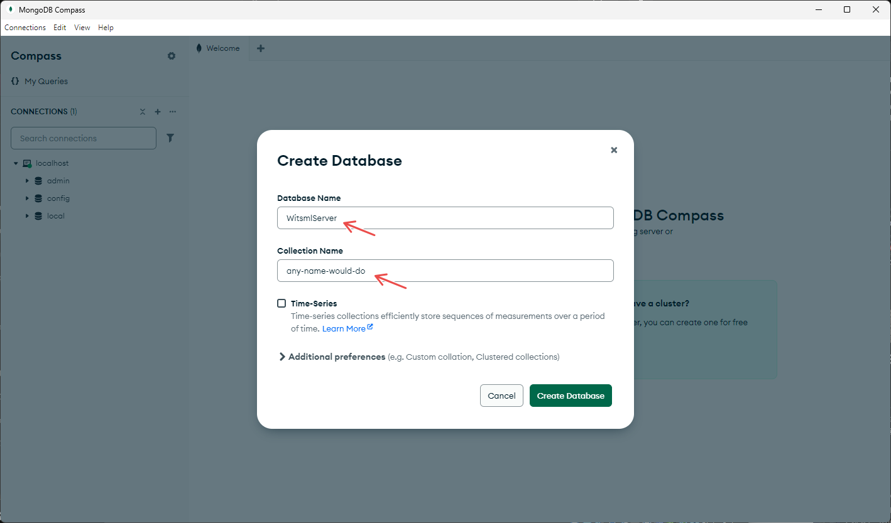
    - Download IIS **URL Rewrite** [here](https://www.iis.net/downloads/microsoft/url-rewrite) and install.

2. **Prepare Environment**:
    - Type "Turn Windows features on or off" in Start and open.
    - Turn on Internet Information Services (IIS).

      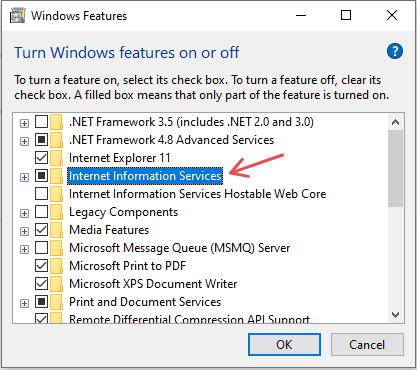
    - Turn on some Application Development Features.

      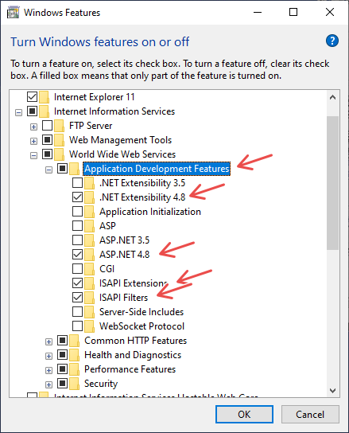
    - Turn on HTTP Activation.

      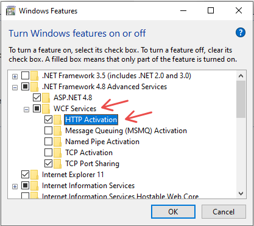

3. **Build the Project**:
    - Run Visual Studio as Administrator.
    - Make sure to finish installing your project components.
      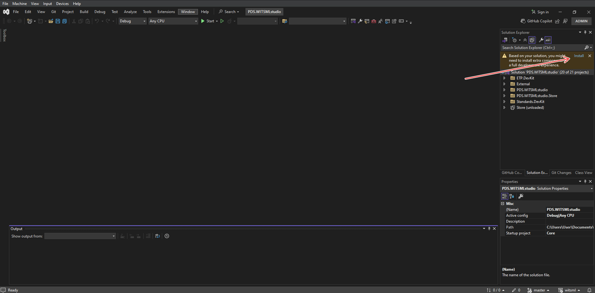
    - Restore NuGet packages.
      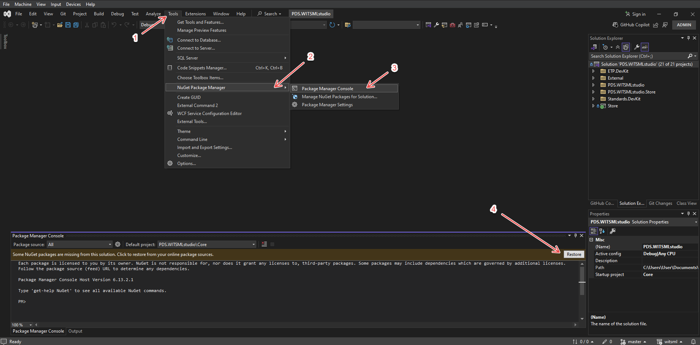
    - Select "Release" and run "Build > Rebuild Solution":
      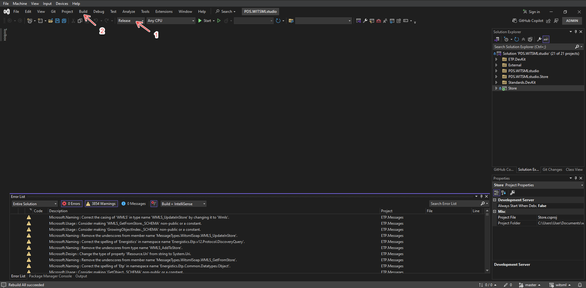

4. **Configure IIS Server**:
    - Open IIS Manager and Add Website by right-click on Sites.
      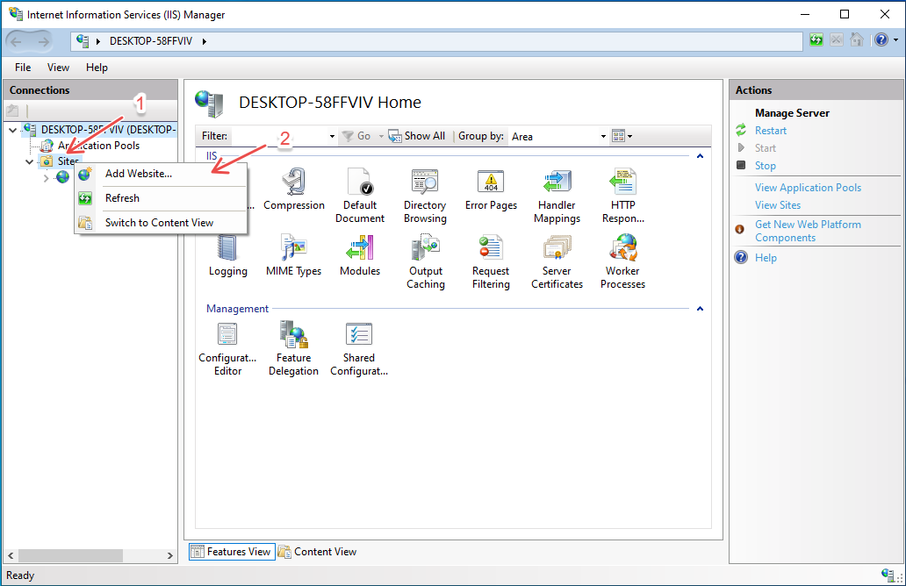
    - Add any site name, set physical path to `<Project-Path>\src\Store` and set your desired port.
      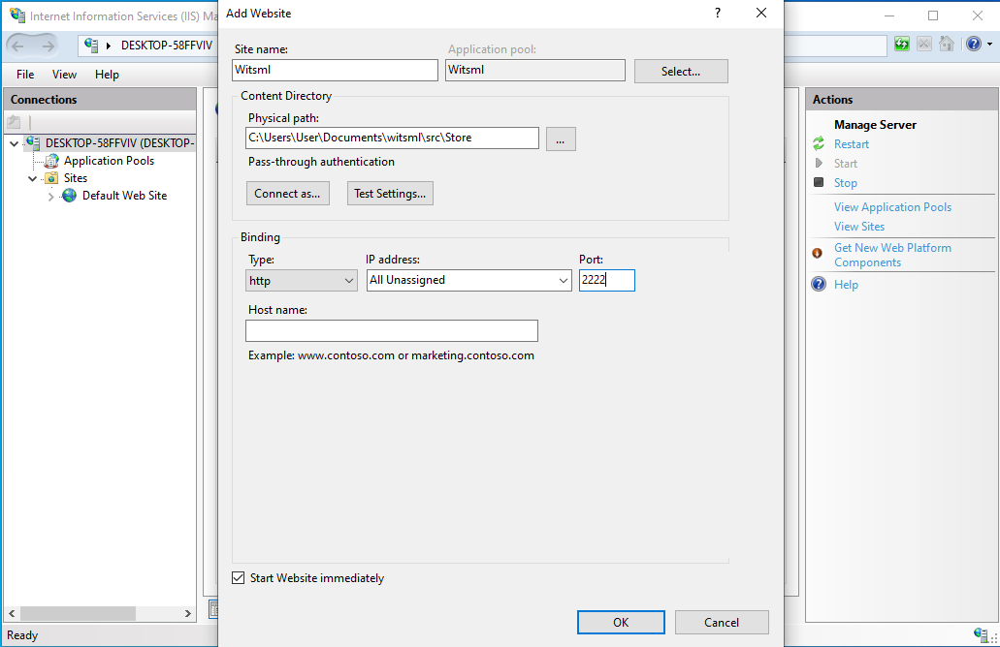
    - Add permissions to `<Project-Path>\src\Store` (by right-click on the folder) to IUSR.
      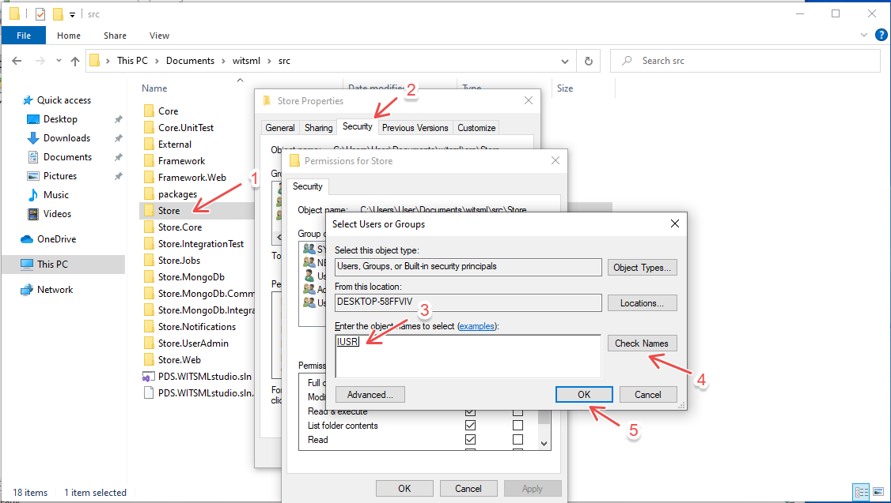

5. **Add a User**:
    - Open PowerShell in the `.\src\Store.UserAdmin\bin` folder.
    - Add a user with your desired credentials:
      ```sh
      .\PDS.WITSMLstudio.Store.UserAdmin.exe add -u <Your-Username> -p <Your-Password> -e <Your-Email>
      ```
      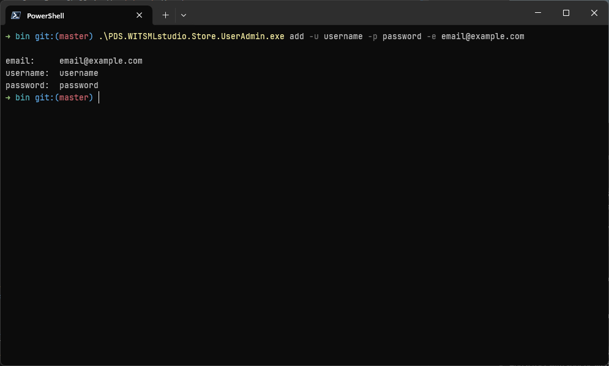

🎉 By completing these steps, the project should be successfully set up and ready for use. 🎉

If you want to containerize the server, follow these steps:

6. **Enable Windows Features for Containers**:
    - Open PowerShell as Administrator and run the following command to enable the required Windows features:
      ```sh
      Enable-WindowsOptionalFeature -Online -FeatureName $("Microsoft-Hyper-V", "Containers") -All
      ```
    - Restart your system if required.

7. **Install and Configure Docker**:
    - Download [Docker Desktop](https://www.docker.com/products/docker-desktop/) (tested on v4.41+) and install.
    - Ensure Docker is running in **Windows Containers** mode. You can switch to Windows Containers by right-clicking the Docker icon in the system tray and selecting "Switch to Windows Containers."

8. **Build and Run the Docker Container**:
    - Open a terminal in this directory and run the following command to build and start the container:
      ```sh
      docker-compose up --build
      ```
    - Once the container is running, the server will be accessible at `http://localhost:8080`.

9. **Add a User**:
    - Open container PowerShell by running the following command:
      ```sh
      docker exec -it <Your-Container-Name> powershell
      ```
    - Add a user with your desired credentials:
      ```sh
      .\Store.UserAdmin\bin\PDS.WITSMLstudio.Store.UserAdmin.exe add -u <Your-Username> -p <Your-Password> -e <Your-Email>
      ```
      

Access the server at `http://localhost:8080/api/soap` using:
- **Username**: `<Your-Username>`
- **Password**: `<Your-Password>`

Use [PDS WITSMLstudio Desktop](https://witsml.pds.technology/studio/) if no client is available.

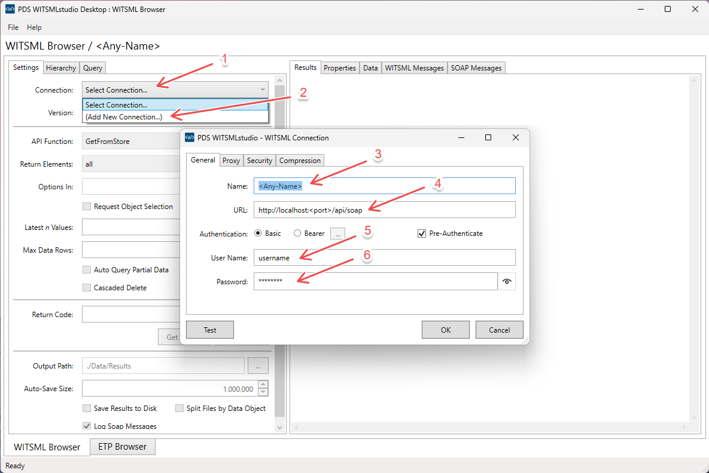

</details>

<details>

<summary>Use Docker image</summary>

Make sure to enable the required Windows features and restart your system if required:
```sh
Enable-WindowsOptionalFeature -Online -FeatureName $("Microsoft-Hyper-V", "Containers") -All
```

To run the WITSML server with a MongoDB backend, follow one of the two setup methods below:

1. **Run your container by one of the following method**:

    1. **Use docker compose**:

        You can easily deploy the WITSML server and MongoDB using Docker Compose. Below is the configuration:

          ```yaml
          services:
            iis:
              image: nazebzurati/witsml:latest
              ports:
                - "8080:80"
              depends_on:
                - mongodb
              networks:
                - witsml-network

            mongodb:
              image: mongo:6.0
              container_name: mongodb
              ports:
                - "27017:27017"
              networks:
                - witsml-network

          networks:
            witsml-network:
          ```

    2. **Use command**:

        Alternatively, you can set up the server and MongoDB with a single command. Run the following commands:

        ```sh
        docker network create --driver nat witsml-network
        docker run -d --name mongodb --network witsml-network -p 27017:27017 mongo:6.0
        docker run -d --name witsml --network witsml-network -p 8080:80 nazebzurati/witsml:latest
        ```
2. **Setup your container**:

    Once the container is running, you'll need to complete some setup steps:

    - Access the container's PowerShell: \
      Run the following command to open a PowerShell session within the container:

      ```sh
      docker exec -it witsml powershell
      ```

    - Add a User: \
      To add a user with your desired credentials, run the following command:

      ```sh
      .\Store.UserAdmin\bin\PDS.WITSMLstudio.Store.UserAdmin.exe add -u <Your-Username> -p <Your-Password> -e <Your-Email>
      ```

Access the server at `http://localhost:8080/api/soap` using:
- **Username**: `<Your-Username>`
- **Password**: `<Your-Password>`

Use [PDS WITSMLstudio Desktop](https://witsml.pds.technology/studio/) if no client is available.


</details>

<details>

<summary>Running on Windows Server</summary>

These setup steps have been tested on Windows Server 2022 (Standard). Follow these steps to set up the server:

1. **Install MongoDB**:
    - Download **MongoDB** [here](https://www.mongodb.com/try/download/community) (tested with v8+), install and ensure it is running on port `27017`.
    - Download IIS **URL Rewrite** [here](https://www.iis.net/downloads/microsoft/url-rewrite) and install.

2. **Install required Windows features using PowerShell**:
    ```sh
    dism /online /enable-feature /featurename:IIS-ASPNET45 /all 
    dism /online /enable-feature /featurename:IIS-ApplicationDevelopment /all 
    dism /online /enable-feature /featurename:IIS-NetFxExtensibility45 /all 
    dism /online /enable-feature /featurename:IIS-ISAPIExtensions /all 
    dism /online /enable-feature /featurename:IIS-ISAPIFilter /all 
    dism /online /enable-feature /featurename:WCF-HTTP-Activation45 /all 
    dism /online /enable-feature /featurename:NetFx4Extended-ASPNET45 /all 
    dism /online /enable-feature /featurename:IIS-WebSockets /all 
    dism /online /enable-feature /featurename:IIS-ApplicationInit /all 
    ```

3. **Setup WITSML server**:
    - Download [wwwroot.zip](https://github.com/nazebzurati/witsml/releases/download/r250505/wwwroot.zip) into `Downloads` folder and extract it.
    - Download [Store.UserAdmin.zip](https://github.com/nazebzurati/witsml/releases/download/r250505/Store.UserAdmin.zip) into `Documents` folder and extract it.
    - Copy the content of `C:\Users\Administrator\Downloads\wwwroot` into `C:\inetpub\wwwroot`.
    - Add a user with your desired credentials, run the following command in PowerShell:

      ```sh
      C:\Users\Administrator\Documents\Store.UserAdmin\PDS.WITSMLstudio.Store.UserAdmin.exe add -u <Your-Username> -p <Your-Password> -e <Your-Email>
      ```

Access the server at `http://<Your-Server-IP>:80/api/soap` using:
- **Username**: `<Your-Username>`
- **Password**: `<Your-Password>`

Use [PDS WITSMLstudio Desktop](https://witsml.pds.technology/studio/) if no client is available.


</details>

---

### Copyright and License
Copyright &copy; 2018 PDS Americas LLC

Released under the PDS Open Source WITSML™ Product License Agreement
http://www.pds.group/WITSMLstudio/OpenSource/ProductLicenseAgreement

---

### Export Compliance

This source code makes use of cryptographic software:
- SSL/TLS is optionally used to secure web communications

The country in which you currently reside may have restrictions on the import, possession,
use, and/or re-export to another country, of encryption software.  BEFORE using any
encryption software, please check your country's laws, regulations and policies concerning
the import, possession, or use, and re-export of encryption software, to see if this is
permitted.  See <http://www.wassenaar.org/> for more information.

The U.S. Government Department of Commerce, Bureau of Industry and Security (BIS), has
classified this source code as Export Control Classification Number (ECCN) 5D002.c.1, which
includes information security software using or performing cryptographic functions with
symmetric and/or asymmetric algorithms.

This source code is published here:
> https://github.com/pds-technology/witsml

In accordance with US Export Administration Regulations (EAR) Section 742.15(b), this
source code is not subject to EAR:
 - This source code has been made publicly available in accordance with EAR Section
   734.3(b)(3)(i) by publishing it in accordance with EAR Section 734.7(a)(4) at the above
   URL.
 - The BIS and the ENC Encryption Request Coordinator have been notified via e-mail of this
   URL.

